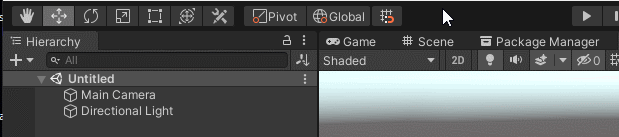

### Getting Started

In Chisel you build your level using generators, brushes, models and operations.

### Models
At the root of your hierarchy you have the Chisel Model:

The model represents all the meshes which are generated from the building blocks 
that you use to create your level, it'll create and manage MeshRenderers and 
MeshColliders and set the generated meshes on them.

This makes Chisel work well with Unity's lightmapping and navigation mesh functionality.

All Generated Meshes are stored under the **<[generated]>** GameObject.

Models will usually be created for you when you create your first brush or generator, 
if a brush or generator ends up outside a model the default model will be added to the 
scene and the generated meshes will be part of that model.

Subsequent brushes and generators will always be added to the currently active model.

You can see on the right how to set the current active model.

### Tool window

You can create generators and brushes using the create tool

This will show you this tool window in the bottom right of your scene-view:

(TODO: create other pages with more detailed descriptions)

**Note: This tool window will *also* show up if you select a model, operation, brush or generator!**
 
 

### Brushes

Brushes are the lowest level primitives, these are simple convex meshes that can be edited by moving/adding and removing vertices, edges, surfaces.

(TODO: add link to page specifically for brush editing)

Note that you cannot create brushes directly, brushes are created through the use of generators.

 

### Generators

Generators will create brushes under the hood, but will hide that from you unless you specifically 
want to convert your generator to brushes using the button in its options tool window.

Once you convert a generator to a brush, you cannot revert it back to a generator.

The reasoning behind it is that this, for instance, allows you keep editing the stairs in the context of it being a stairs, instead of a bunch of pritimives that you've placed.

### Operations

All brushes, generators and operation components allow you to set the current boolean operation you want to use.

This allows you to take your brush or generator and instead of adding the geometry to your model, you can subtract it using a subtractive operation,
or use an intersection operation to only add the common area between two brushes and/or generators to your model.

 If you use an operation to group brushes and/or generators then you can perform an operation on them together as a group. 

 This in turn allows you to create more complicated shapes and perform operations with the entire shape, on another shape.