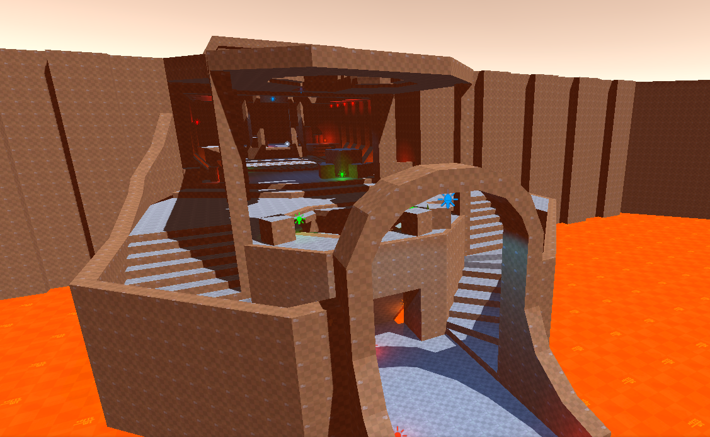

# [Chisel.Prototype](https://github.com/RadicalCSG/Chisel.Prototype)

Chisel is an extension for **Unity** that allows for _rapid_, iterative, **non destructive** level editing!

---
[Click here for information on how to get started](GettingStarted.md)

Want to help out?
[We have some good first issues here](https://github.com/RadicalCSG/Chisel.Prototype/labels/good%20first%20issue)

If you have questions be sure to ask in the discord!

**[Click here for to join the official Discord server!](https://discord.gg/zttNkPQ)**

Notes:
- Chisel requires Unity 2020.2a17 or newer
- UX is still under development
- CSG algorithm is still under development
- It is *not yet* ready for production, but please feel free to try it out!

Known issues:
* There are some cases where triangulation fails, possibly related to previous vertex merging issue
  (please collect failure cases so we can later verify we fixed them)
* Normal smoothing is not yet implemented

Packages overview:
* `com.chisel.core` Low-level API and functionality (based on DOTS technology)
* `com.chisel.editor` Unity Scene Editor functionality and API, tools and UI
* `com.chisel.components` Unity Monobehaviour runtime API (to allow for possible ECS replacement in future)
* `com.scene.handles.extensions` Custom scene handle extensions

The core technology is based on the algorithm explained in [this GDC 2020 talk](http://www.youtube.com/watch?v=Iqmg4gblreo)

